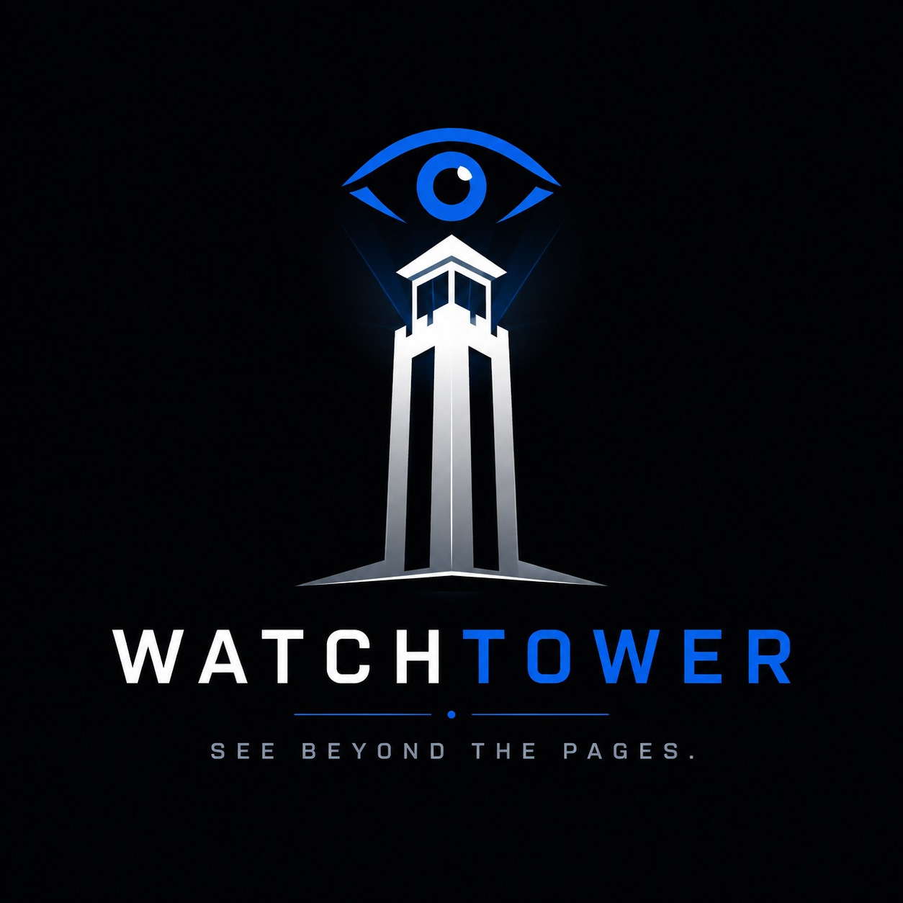
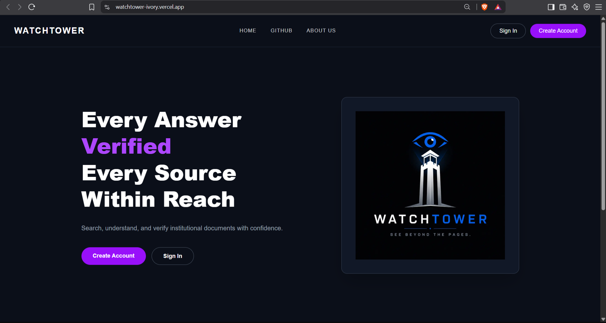
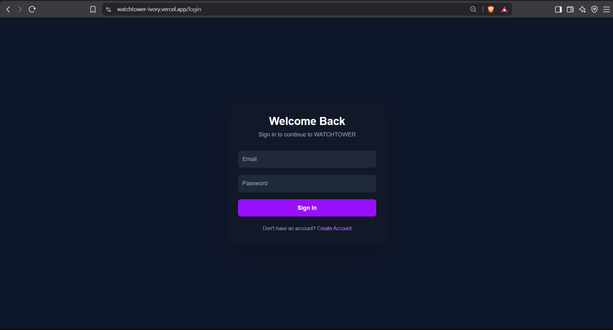
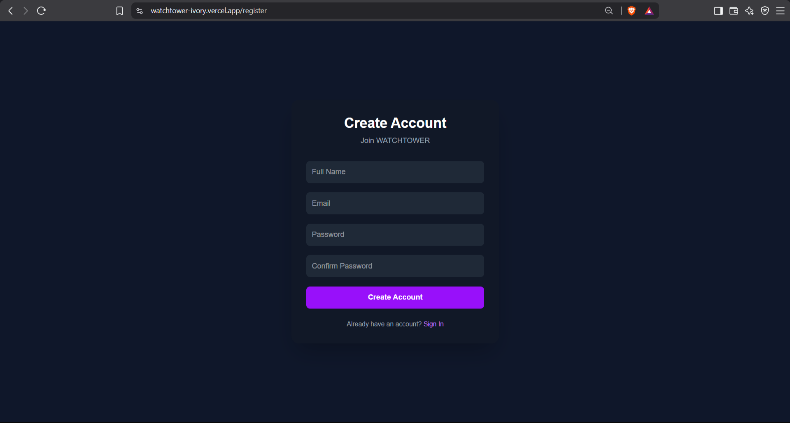
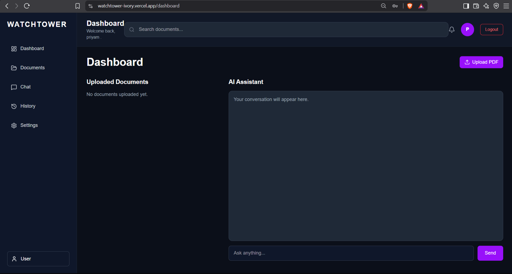
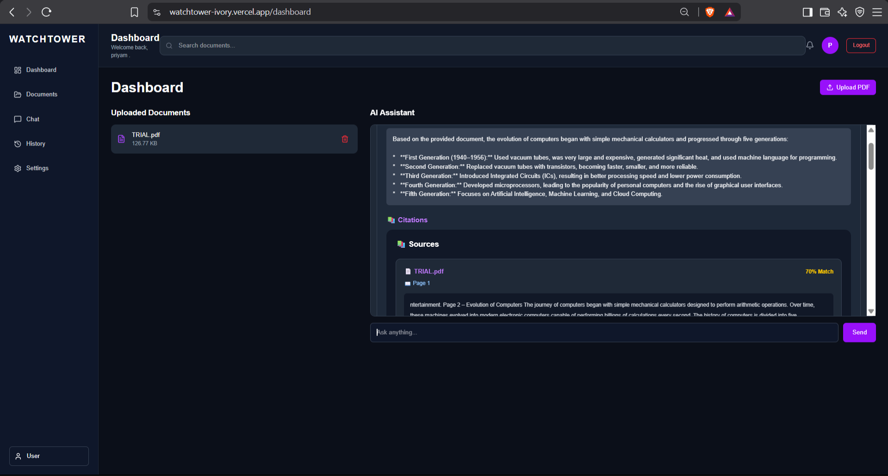

<div align="center">



# WATCHTOWER

### AI-Powered Document Intelligence Platform

*"Every Answer. Verified. Every Source. Within Reach."*

[]()
[]()
[]()
[]()
[]()

</div>

---

# Overview

WATCHTOWER is an AI-powered document intelligence platform that enables users to search, understand, and verify information from institutional documents using Retrieval-Augmented Generation (RAG).

Instead of manually searching through lengthy PDFs, users can upload documents and ask natural language questions. WATCHTOWER retrieves the most relevant information using semantic search and generates accurate, context-aware answers with Google Gemini AI.


# Problem Statement

Students and professionals often spend significant time searching through large documents such as:

- Academic notes
- College guidelines
- Research papers
- Policy documents
- Manuals
- Reports

Traditional keyword search frequently misses relevant information because it relies on exact word matches rather than meaning.

WATCHTOWER solves this problem using semantic search and AI-powered document understanding.

---

# Features

- AI-powered document question answering
- PDF upload and processing
- Semantic search using vector embeddings
- Retrieval-Augmented Generation (RAG)
- Google Gemini AI integration
- User authentication
- Fast document retrieval with ChromaDB
- Clean and responsive web interface
- Secure document-based responses

---

# How WATCHTOWER Works

```text
                Upload PDF
                     │
                     ▼
           Extract Text (PyMuPDF)
                     │
                     ▼
              Text Chunking
                     │
                     ▼
      Sentence Transformer Embeddings
                     │
                     ▼
          Store in ChromaDB
                     │
                     ▼
          User asks a Question
                     │
                     ▼
          Semantic Similarity Search
                     │
                     ▼
       Relevant Chunks Retrieved
                     │
                     ▼
          Google Gemini AI
                     │
                     ▼
          Intelligent Answer
```

---

# Tech Stack

## Frontend

- Next.js
- React
- Tailwind CSS
- TypeScript

## Backend

- FastAPI
- SQLAlchemy
- JWT Authentication
- PyMuPDF


## Artificial Intelligence

- Google Gemini 3.5 Flash
- Sentence Transformers
- all-MiniLM-L6-v2

## Database

- SQLite
- ChromaDB (Vector Database)

## Deployment

- Railway
- GitHub

---

# Project Structure

```text
WATCHTOWER/

├── backend/
│   ├── app/
│   ├── uploads/
│   ├── chroma_db/
│   └── requirements.txt
│
├── frontend/
│   ├── app/
│   ├── components/
│   ├── public/
│   └── package.json
│
├── README.md
└── LICENSE
```

---

# 📸 Screenshots

## 🏠 Landing Page



---

## 🔐 Login



---

## 📝 Register



---

## 📊 Dashboard



---

## 💬 AI Chat



---

## 👥 About Us


# Installation

## Clone Repository

```bash
git clone https://github.com/surediepie/WATCHTOWER.git

cd WATCHTOWER
```

---

## Backend

```bash
cd backend

python -m venv venv

venv\Scripts\activate

pip install -r requirements.txt

uvicorn app.main:app --reload
```

---

## Frontend

```bash
cd frontend

npm install

npm run dev
```

---

# Team

| Name | Role |
|------|------|
| Priyam Kumar | Team Lead • Backend & AI Engineer |
| Pritam Nayak | System Integration Engineer |
| Somesh Jena | Frontend Engineer |
| Somanath Kundu | UI Engineer |

---

# Future Enhancements

- Multi-document search
- OCR support for scanned PDFs
- Citation highlighting
- Role-based access control
- Document summarization
- Multi-language support
- Voice-based document queries
- Cloud storage integration

---

# Repository

GitHub

https://github.com/surediepie/WATCHTOWER

---

# License

This project is licensed under the MIT License.

---

<div align="center">

### Built with ❤️ by Team WATCHTOWER

*"Every Answer. Verified. Every Source. Within Reach."*

<<<<<<< HEAD
</div>
=======
</div>
>>>>>>> 6f65856 (Add project screenshots to README)
